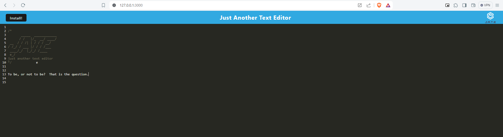

# JATE Text Editor

## Description

Jate-PWA is a single-page text editing web application designed to meet the criteria of a Progressive Web App (PWA). This means it can be installed on a user's device and utilized offline, while still functioning within the browser. Utilizing various web technologies such as IndexedDB for data storage, webpack for JavaScript file compilation, and service workers for offline capabilities, this application ensures seamless usage. With a user-friendly interface, it allows effortless note-taking and saving. Additionally, users can easily install the text editor for quick access directly from their device's home screen or app menu.

## Table of Contents
- [Installation](#installation)
- [Usage](#usage)
- [License](#license)
- [Contributing](#contributing)
- [Tests](#tests)
- [Questions](#questions)
- [Screenshots](#screenshots)
- [Demonstration Video](#video)
- [GitHub Link](#github-link)

## Installation
1. "**Node.js**" must be installed on local machine.
2. Once in your project folder please type "**npm i -y**" for all dependencies.

## Usage
Clone the repository to your local machine.
`git clone https://github.com/harrymac1972/text_editor.git` 
Navigate to the project directory.
`cd text-editor` 
Install the required dependencies.
`npm install`

## License
This application is licensed by: [MIT](https://opensource.org/licenses/MIT)

## Contributing
You may 'fork' the project in the github repository.

## Tests
n/a

## Questions
If you have any questions, please contact:
-- (https://github.com/harrymac1972)
-- harrymac1972@gmail.com.

## Screenshots

## Demonstration Video
n/a

## GitHub Link
<a href="https://github.com/harrymac1972/text_editor">Text Editor on Github</a>

## Heroku Link
<a href="https://rocky-sea-17449-8e9d586ddb44.herokuapp.com/">Text Editor on Heroku</a>